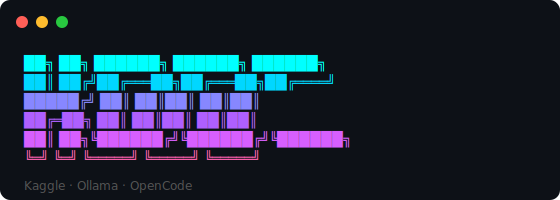

<p align="center">
  
</p>

# kooc — Kaggle OpenCode Launcher

A colorful interactive terminal launcher that connects to a remote [Ollama](https://ollama.com) instance running on a Kaggle GPU, lets you pick a model with arrow keys, and launches [OpenCode](https://opencode.ai) against it.

---

## How it works

```
Kaggle GPU (T4×2)
  └─ Ollama server
       └─ Cloudflare Tunnel → public URL
                                  ↕
                            kooc script
                               ↓
                           opencode TUI
```

1. You enter (or confirm) your Kaggle tunnel URL
2. `kooc` runs `ollama list` against the remote instance to fetch available models
3. You pick a model from an interactive `fzf` picker
4. OpenCode launches with that model over `OLLAMA_HOST`

---

## Requirements

| Tool | Purpose | Install |
|------|---------|---------|
| `bash` | Shell | Pre-installed on macOS/Linux |
| [`ollama`](https://ollama.com) | CLI to query remote Ollama | `brew install ollama` |
| [`fzf`](https://github.com/junegunn/fzf) | Interactive model picker | `brew install fzf` |
| [`opencode`](https://opencode.ai) | AI coding assistant TUI | See opencode docs |
| A running Kaggle session | Remote GPU inference | See [Kaggle setup](#kaggle-setup) |

---

## Install

```bash
# Clone the toolbox (if you haven't)
git clone https://github.com/iamefe/toolbox ~/toolbox

# Symlink kooc to somewhere on your PATH
ln -s ~/toolbox/kooc/kooc ~/.local/bin/kooc
chmod +x ~/.local/bin/kooc
```

Or copy it directly:

```bash
cp ~/toolbox/kooc/kooc /usr/local/bin/kooc
chmod +x /usr/local/bin/kooc
```

---

## Usage

```bash
kooc
```

You'll see an interactive prompt:

```
   ██╗  ██╗ ██████╗  ██████╗  ██████╗
   ██║ ██╔╝██╔═══██╗██╔═══██╗██╔════╝
   █████╔╝ ██║   ██║██║   ██║██║
   ██╔═██╗ ██║   ██║██║   ██║██║
   ██║  ██╗╚██████╔╝╚██████╔╝╚██████╗
   ╚═╝  ╚═╝ ╚═════╝  ╚═════╝  ╚═════╝
   Kaggle · Ollama · OpenCode

   Kaggle URL (Enter to use: https://your-url.trycloudflare.com)
   ▶ _
```

Hit **Enter** to use the pre-filled URL (from `$KAGGLE_URL`), or paste a new one. Then pick a model from the `fzf` list and OpenCode launches.

---

## Kaggle setup

`kooc` is designed to work with a Kaggle notebook that runs Ollama on a T4×2 GPU and exposes it via a Cloudflare tunnel. See the companion notebook:

[`ai-automation/docs/notebooks/ollama-t4.ipynb`](https://github.com/iamefe/ai-automation/blob/main/docs/notebooks/ollama-t4.ipynb)

The notebook:
- Downloads and starts Ollama with T4×2 optimizations (flash attention, quantized KV cache, dual GPU)
- Opens a Cloudflare tunnel to port 11434
- Pulls and pre-warms your chosen model into VRAM
- Prints the tunnel URL to use with `kooc`

---

## Troubleshooting

**"Could not reach Ollama"**
- Your Kaggle session may have timed out or the tunnel URL has changed
- Restart the Kaggle notebook and update `KAGGLE_URL`

**"No models found"**
- The tunnel is reachable but Ollama has no models — run Cell 5 in the notebook to pull one

**`fzf: command not found`**
- Install fzf: `brew install fzf`

**`opencode: command not found`**
- Install OpenCode: see [opencode.ai](https://opencode.ai)

**`ollama: command not found`**
- Install Ollama CLI: `brew install ollama` (the server doesn't need to run locally — just the CLI)

---

## License

MIT
